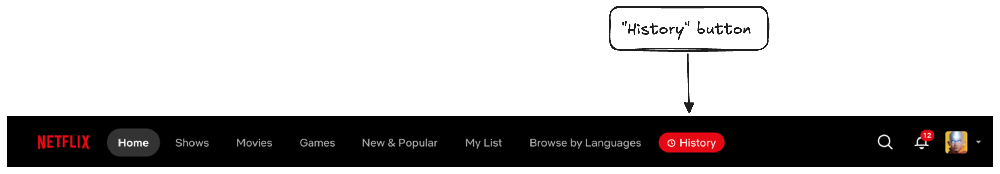

  

# Netflix Watch History

Adds a **History** button to the Netflix navbar. Thumbnails and IMDb links included.

## Install

[link-chrome]: https://chromewebstore.google.com/detail/watch-history-for-netflix/gmdgnkllicjpablnahoijlkojeecapho 'Version published on Chrome Web Store'
[link-firefox]: https://addons.mozilla.org/firefox/addon/watch-history-for-netflix/ 'Version published on Mozilla Add-ons'

[][link-chrome] [][link-chrome] [Install for Chrome][link-chrome]

[][link-firefox] [][link-firefox] [Install for Firefox][link-firefox]

## Features

- One-click access to your viewing activity from the navbar
- Thumbnails for every title in the activity list
- IMDb search link next to each title
- Thumbnail URLs cached locally, so lists load fast after first visit

## Notes

- Works with the active profile (uses `netflix.com/viewingactivity`)
- No permissions beyond running on `netflix.com`
